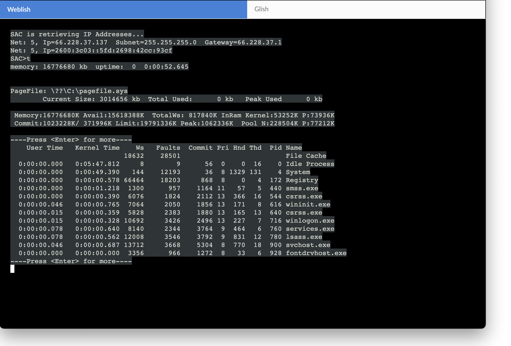
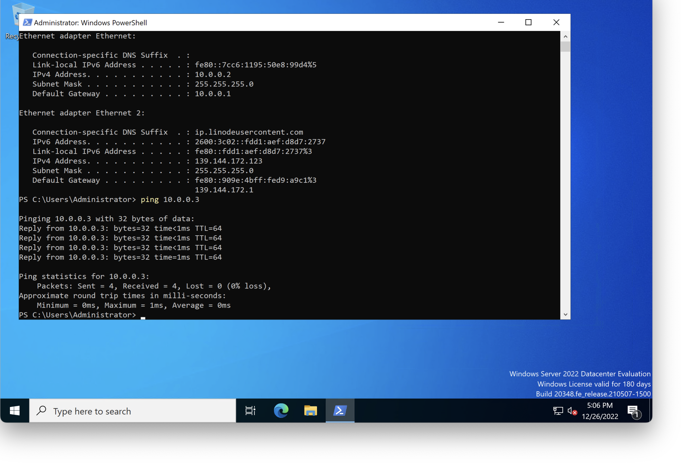
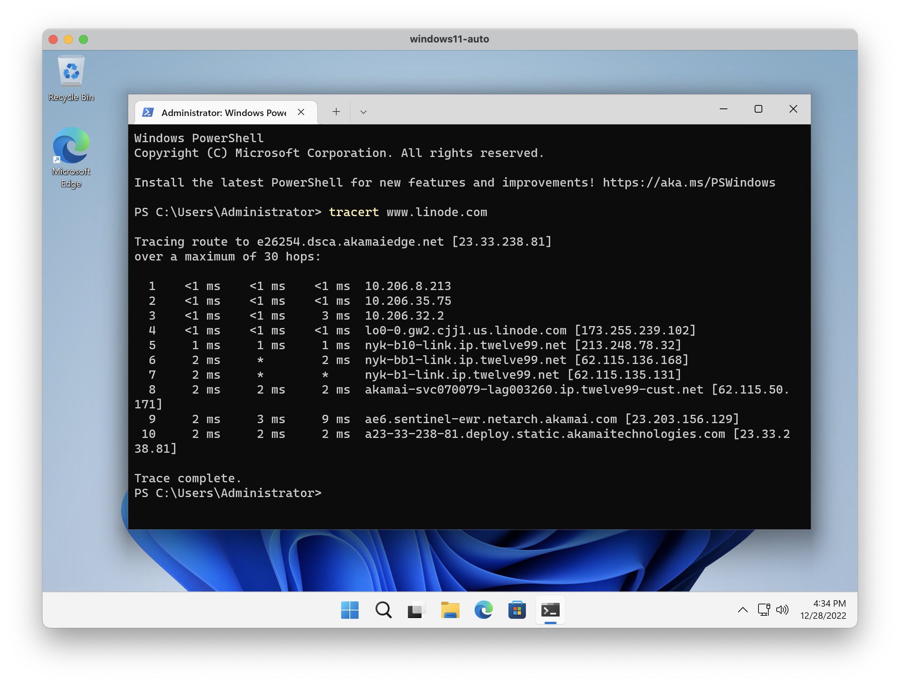

# winode
Automated BYO License Windows Install on Linode - Launchable from Stackscripts

*Warning: This is an unofficial capability that is not officially supported by Linode or Akamai Technologies.  Use at your own risk*

**Please do NOT contact Linode support with questions about Windows as it is out of their scope of support at this time.  Feel free to open an issue here, but there is no guarantee of support.**

# Features

1. Fully automated installation from upstream Microsoft ISO images for both Windows Server 2022 and Windows 11.  No need to create an initial install on a local server and upload it to Linode.
2. Automation slipstream of all latest VirtIO drivers resulting in full support for Linode local disks (SCSI), network including VLAN and private IPs, and block storage volumes.
3.  Automatic enablement of Emergency Management Services (EMS) to the Linode a LISH allowing for recovery via Cloud Manager and SSH.  LISH access then allows for easy access for troubleshotting and quickly changing an instances IP address.
4.  Automatic enablement of Remote Desktop (RDP) over TCP/3389.  Use Linode Cloud Firewall rules to restrict access!

# Windows License

By default installations are started without a product key and will default to evaluation mode.  The autounattend.xml templates may be modified to insert your own valid product key, or you may manually provide a product key later after your installation is running.  Please note that it is the users responsibiltiy to ensure you are in compliance with Microsoft license terms.  Microsoft allows for use of the evaluation version for testing only.

# Known Issues

1.  Linode Backups require EXT raw filesystem.  The RAW partitioned disk for a winode is therefore not supported.  Critical data should be backed up via some other mechanism.  Linode Object Storage (OBJ) could be leveraged to store this data.
2.  As of December 2022 Linode doesn't support nested virtualization.  As a result Windows Subsystem for Linux (WSL2) will not function.  You may still run WSL1 by forcing it with "wsl --set-default-version 1".  On Windows 11 the following Powershell command is also required "New-ItemProperty HKCU:\SOFTWARE\Microsoft\Windows\CurrentVersion\Lxss DefaultVersion -Value 1 -Force"
3.  Resizing your local disk to a larger disk is supported, but requires manually expanding the NTFS volume within Windows following resizing the RAW Linode disk.  To shrink your disk you must shrink the NTFS volume, and then use a temporary block storage volume to backup the volume, delete the local disk, add a new local disk, and copy the contents back from Block Storage.
4.  The Linode GLISH VNC recovery console lacks support for sending CTRL-ALT-DEL.  The easiest work around is to just use the provided RDP defaults and use a Remote Desktop client.  Alternatively you can extract a valid GLISH session ID and use noVNC to connect over a WebSocket.
5.  Network configurations default to using DHCP.  It is suggested as a best practice to move to a static IP address configuration as well as any further customizations you wish to make.

# Getting Started

1.  Copy/paste or otherwise insert install-windows.sh into a new StackScript that you create with an Ubuntu 22.04 image target.  
2.  Create a new Linode using this Stackscript. If using Cloud Manager, fill in the UDF variables including a valid Linode API token.  If using the API to create your instance insert UDF variables with your API call. Total install time varies, but is typically 15-30 minutes.  Your winode will reboot several times as part of the install process.  If installing Windows 11 you must provide your own valid ISO download URL.  You may get a new URL by going to (https://www.microsoft.com/en-us/software-download/windows11).  Note that URLs are valid for 24 hours and then must be updated again.  Alternatively you may download your own copy and self-host it for future installs should you have a right to do so.
3.  Currently the temporary 30GB block storage volume used by the installer is not automatically deleted.  You can safetly delete this following your instatllation.  Volumes are labeled as "temp-\<linodeID\>".

# Instance Requirements
- Windows Server instances will run on a Nanode with 1GB of RAM (512MB is Microsoft minimum), but performance is very poor.
- Windows 11 officially requires at least 4GB of RAM.

# Screenshots

